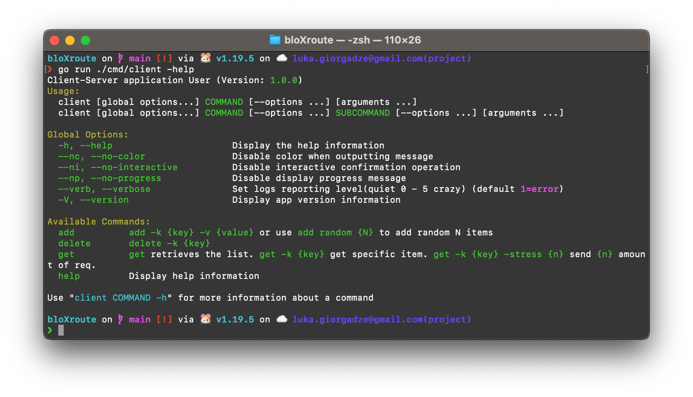
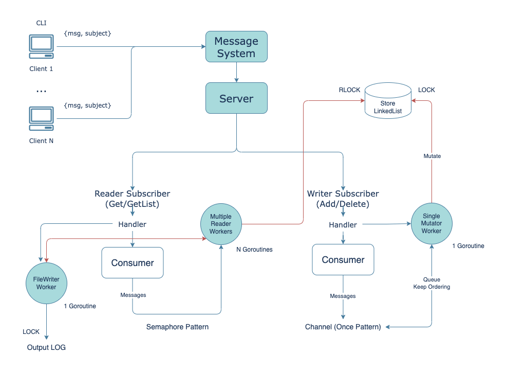

# Client-Server Application

## Project Description

This is a multi-threaded client-server Event-Driven Architecture application that allows clients to communicate with a server using an external queue. Clients can be configured either from a command line or from a file and can read data from a command line.

Clients can send requests to the server to add an item, remove an item, get a single item or all items from the server. Items are in the form of a string and consist of a key and a value.

The server has data structure(s) that holds the data in memory while keeping the order of items as they were added. The data structure used is a LinkedList. The get function returns items in the order they were added. If an item is removed, it is no longer returned in get requests.

Clients can be added or removed without interfering with the server or other clients.

_Scroll down to see detailed requiremenets._

## Getting Started

Run server and client(s) locally:

1. `docker-compose up nats`
1. `go run ./cmd/server`
1. `go run ./cmd/client add -k "name" -v "Luka"`
1. `go run ./cmd/client get`

Alternatively, you can run the server and nats with `docker-compose` and use only client on local:

1. `docker-compose up`
1. `go run ./cmd/client add -k "name" -v "Luka"`
1. `go run ./cmd/client get`

#### Example
1. `go run ./cmd/client add random -n 5`
1. `go run ./cmd/client delete -k "key_3"`
1. `go run ./cmd/client get`

Will return: `(key_1=Value 1),(key_2=Value 2),(key_4=Value 4),(key_5=Value 5)`

#### Configuration

- `NatsURL` - NATS host url (default: 0.0.0.0:4222);
- `NatsUser` - NATS username (default: dummy);
- `NatsPass` - NATS password (default: password);
- `SemaphoreReadMaxGoroutines` - Maximum number of goroutines running in parallel to read the data concurrently;
- `OutputFilePath` - Path of output file (default: ./output/items.log) If no value is assigned ("") data won't be written in the file;
- `Pprof` - [pprof](https://github.com/google/pprof) is a tool for visualization and analysis of profiling data. (default: false)
- `PprofURL` -  (default: 127.0.0.1:8080)

## Architecture

### Folder Structure
*by [Standard Go Project Layout](https://github.com/golang-standards/project-layout)*
- `assets` -  images, logos, etc;
- `cmd` - Main applications for this project;
- `configs` - Configuration file templates and default configs;
- `internal` - Private application and library code. Business Logics;
- `output` - Logs.

### System Design
The project has been thoughtfully designed with a focus on decoupling logical components into small, self-contained units that share common data and types. The development process was guided by best practices and widely-accepted design patterns, including the Twelve-Factor App methodology, SOLID & KIS principles.

---

<strong>Requiremenet Details</strong>

 
You need to implement a **Client-Server application** with the following requirements:
* multiple-threaded server;
* clients;
* External queue between the clients and server.

Clients:

- Should be configured from a command line or from a file (you decide);
- Can read data from a file or from a command line (you decide);
- Can request server to AddItem(key, value), RemoveItem(key), GetItem(key), GetAllItems()
- Data is in the form of strings.

- Clients can be added / removed while not interfering to the server or other clients.

Server:

- Has data structure(s) that holds the data in the memory while keeping the order of items as they added (Ordered Map for C++);
  - The data structure must keep the order of items as they added.
    For example: If client added the following items in the following order (A, a), (B, b), (D, d), (E, e), (C, c).
    The GetAllItems returns (A, a), (B, b), (D, d), (E, e), (C, d)
    If item D was removed, the GetAllItems return (A, a), (B, b), (E, e), (C, c)
- Server should be able to add an item, remove an item, get a single or all item from the data structure;
- An item consists of a key (string) and a value (string)

External queue:

- Can be Amazon Simple Queue Service (SQS) or RabbitMQ (you decide);

Clients send requests to the external queue - while the server reads those and execute them on its data structure. You define the structure of the messages (AddItem, RemoveItem, GetItem, GetAllItems)

The flow of the project:

1. Multiple clients are sending requests to the queue (and not waiting for the response).
2. Server is reading requests from the queue and processing them, the output of the server is written to a log file
3. Server should be able to process items in parallel
4. log messages (debug, error) are written to stdout

Definition of success:

- Working project that can be executed on your computer (preferred OS = linux)
- Being able to explain how the project works and how to deploy the project (for the first time) on another computer
- If you take something from the Internet or consult anyone for anything, you should be able to understand it perfectly
- Code has no bugs, no dangling references / assets / resources, no resource leaks
- Code is clean and readable
- Code is reasonably efficient (server idle time will be measured)
- Working with channels
- Working with go func
- Separate between components
- You implement the data structure(s) by yourself

You should develop the project using GOLang.

